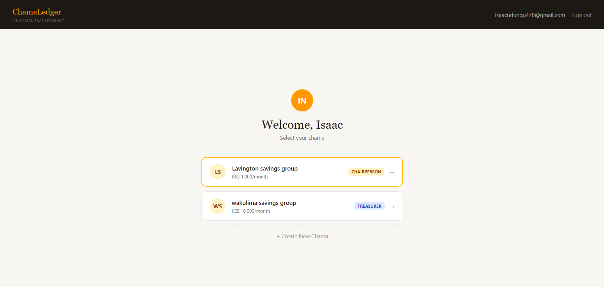
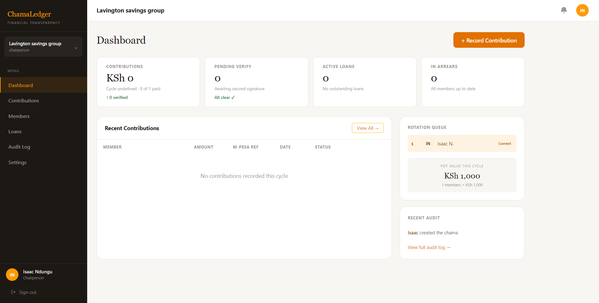

# ChamaLedger — Group Financial Transparency for Kenyan Chamas
ChamaLedger is a full-stack financial management web application for Kenyan chama (informal savings) groups. Built with the MERN stack (MongoDB, Express.js, React, Node.js), it replaces handwritten notebooks and WhatsApp screenshots with an immutable, multi-user financial ledger that no single person can manipulate. The platform enforces two-person verification on every contribution, democratic quorum voting on loans, and maintains a permanent audit trail of every financial action.

## Contributor 
Isaac Ndungu

## Project Brief
ChamaLedger addresses a specific and well-documented failure mode in Kenyan chama groups: financial disputes caused by poor record-keeping, not lack of money. When a treasurer's notebook is the only record, every disputed payment becomes a social conflict. ChamaLedger makes the record the neutral third party.

The application is built around three roles — Chairman, Treasurer, and Member — each with a distinct set of permissions and a tailored view of the group's finances. Officers see group-level metrics and pending actions. No single officer can record and verify their own entry. No loan is disbursed without majority group approval.

The backend is a REST API built with Express.js and MongoDB Atlas, secured with JWT access tokens and httpOnly refresh token cookies. The frontend is a React single-page application built with Vite and styled entirely with Tailwind CSS. Real-time contribution updates are delivered via Server-Sent Events without the complexity of WebSockets.

The application is structured around five core modules:

* Contributions — recording, two-person verification, dispute flagging, and M-Pesa reference tracking
* Loans — applications, quorum-based member voting with public voter roll, and repayment recording
* Members — role management, rotation queue for pot disbursement, and individual financial profiles
* Audit Log — immutable, chronological record of every financial action with actor attribution
* Statements — server-generated PDF statements per member, exportable for bank loan applications

## Core Features 

Authentication 

* Register and login with email or sign in with google

Chama Management

* Create and manage multiple chamas from a single account
* Chama switcher — one user can be chairman in one group and a member in another
* Configurable contribution amount, meeting frequency, and default loan interest rate

Contributions

* Record contributions with mandatory M-Pesa transaction reference
* Unique index on M-Pesa ref per chama — duplicate payments are rejected at the database level
* Two-person verification rule enforced server-side — the officer who records cannot verify
* Dispute flagging with a required written note

Loans

* Loan applications with live flat-rate calculation preview (principal, total interest, monthly instalment)
* Public voter roll — every member sees who voted and how, including rejection reasons
* Borrower is excluded from voting on their own application, enforced server-side
* Early rejection detection — loan is marked rejected as soon as quorum becomes mathematically impossible

Members

* Invite members by email — user must have a registered account
* Role assignment: Chairman (governance), Treasurer (operations), Member (read + vote)
* Rotation position tracking for merry-go-round pot disbursement
* Individual member ledger: total contributed, total owed, balance, and arrears status
* Member profile with full contribution history and transaction history slide-over panel

Audit Log

* Every write action produces an immutable audit entry — pre-hooks prevent updates or deletes
* Human-readable entries with actor name, action description, and full before/after snapshots

PDF Statements

* Server-side generation with PDFKit — never in the browser
* Member statements include ledger summary, full contribution history, and loan history

## Technology Stack
### Backend

* Node.js + Express.js
* MongoDB Atlas + Mongoose
* bcryptjs for password hashing
* PDFKit for server-side PDF generation

### Frontend

* React 18 + Vite
* Tailwind CSS
* React Router v6

### Infrastructure

* Railway (backend deployment)
* Vercel (frontend deployment)
* MongoDB Atlas 

## Screenshots 

## Future Improvements

* M-Pesa Daraja API integration — automatic payment confirmation without manual M-Pesa reference entry
* React Native mobile app — treasurers record contributions during meetings from their phone
* SACCO module — support for interest-bearing savings, dividends, and share capital tracking
* Automated overdue reminders — scheduled notifications for members in arrears
* Multi-language toggle — English and Swahili throughout the interface